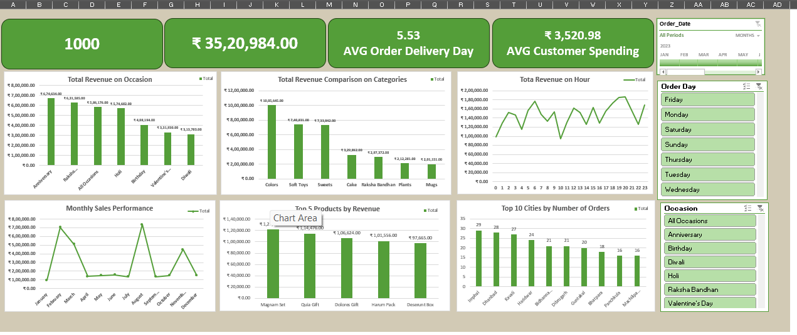

📊 FNP Sales Analysis Dashboard – Excel Project
🎯 Project Objective

This project analyzes FNP sales data using Microsoft Excel to generate business insights across occasions, products, customers, and time trends. The goal was to transform multi-table raw data into a clean analytical dataset and build an interactive dashboard for decision-making.

📂 Dataset Structure

The project was built using three separate raw datasets:

Customers — customer details and unique customer IDs

Orders — order transactions, dates, occasions, revenue

Products — product names and categories

After cleaning and merging, a final modeled dataset was created:

Final File: FNP_sales_data.xlsx — used for Pivot Tables and dashboard reporting

🛠 Tools Used

Microsoft Excel

Pivot Tables

Pivot Charts

Slicers

Calculated Columns

KPI Cards

Dashboard Layout Design

📈 Dashboard Features

The interactive dashboard includes:

✅ Total Revenue KPI

✅ Average Customer Spending

✅ Average Order Delivery Days

✅ Revenue by Occasion

✅ Category-wise Revenue Comparison

✅ Hourly Revenue Trend

✅ Monthly Sales Performance

✅ Top 5 Products by Revenue

✅ Top 10 Cities by Orders

✅ Orders by Weekday

✅ Interactive slicers (Date, Occasion, Order Day)

💡 Key Insights

Occasion-based sales contribute a major share of total revenue

A small number of products generate the highest revenue

Sales show strong monthly and seasonal spikes

Certain cities contribute significantly more orders

Customer spending patterns vary by occasion and category

🚀 Learning Outcomes

Multi-table data merging and modeling

Excel data cleaning workflow

Pivot-based business analysis

KPI dashboard building

Interactive reporting with slicers

Converting raw data into decision insights

